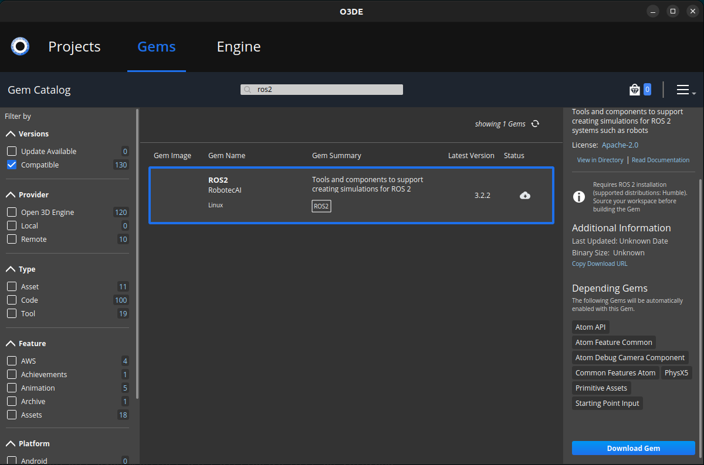
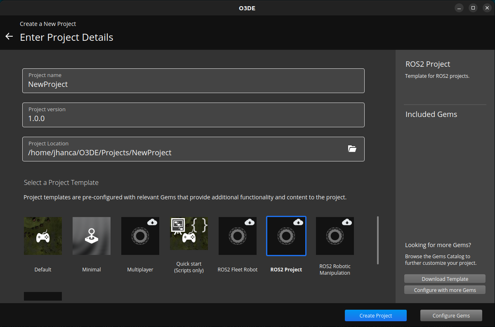
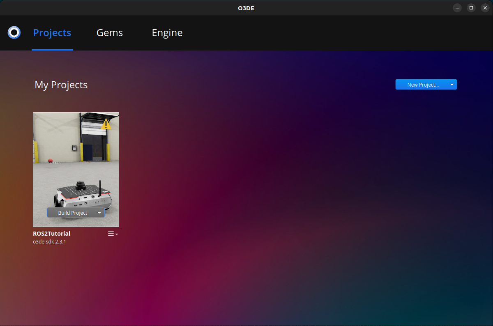

Installation (Ubuntu)
========================

**Goal:** Install Open 3D Engine (O3DE) SDK, add O3DE simulation modules and build a project using provided template.

**Tutorial level:** Advanced

**Time:** 20-30 minutes

.. contents:: Contents
   :depth: 2
   :local:

Background
-------------

This tutorial will guide you through the steps to install Open 3D Engine (O3DE) SDK using a *.deb* package and set up the O3DE simulation modules on Ubuntu Linux. Finally, you will create a project using a provided template and start the simulation. The guide minimizes terminal use and focuses on GUI-based steps where possible.

Prerequisites
----------------

It is recommended to understand basic ROS principles covered in the beginner :doc:`../../../../Tutorials`.

Set up O3DE from *.deb* package on Ubuntu Linux and creating a new project
-----------------------------------------------------------------------------

Step 1: Install O3DE SDK
^^^^^^^^^^^^^^^^^^^^^^^^^^^

First, download the recent O3DE binary package from the `O3DE website <https://www.o3de.org/>`_. Next, install the downloaded package in your system.

.. code-block:: bash

   sudo dpkg -i ~/Downloads/o3de_2409_1.deb

Note: The name of the binary and the location depends on the newest available O3DE version and the download location.

Step 2: Run O3DE and add required Gems
^^^^^^^^^^^^^^^^^^^^^^^^^^^^^^^^^^^^^^^^^

O3DE is built using modular components known as Gems. As you work on a project, you can enhance it by adding Gems that provide specific features and functionality. These Gems can include a variety of resources, such as materials, textures, and models, development tools, or complete runtime systems such as the renderer, AI, and Physics. The following instructions explain how to start O3DE and install Gems required for the selected project template.

First source the ROS 2 environment, if not done already.

.. code-block:: console

   source /opt/ros/{DISTRO}/setup.bash

Next, start O3DE project manager:

.. code-block:: bash

   o3de

Finally, switch to **Gems** tab and hit the *refresh* button in the top right corner first, to ensure the system finds the newest Gems' versions available. Download the following Gems by clicking **Download Gem** button in the bottom right corner for each Gem:

- ROS2
- RosRobotSample
- WarehouseSample

You might want to use the search tool to find Gems quicker:

Do not close the window after finishing.

Step 3: Configure the O3DE Project
^^^^^^^^^^^^^^^^^^^^^^^^^^^^^^^^^^^^^

Switch back to **Projects** tab in your O3DE Project Manager window and select **Create New Project** option from the **New Project** dropdown menu to create a new simulation project. It's name, location on the hard drive, and version can be modified in the next window. Note down the project location and the name for the later use.

The project can be build based on one of the templates. *ROS2 Project* template is used in this and in the following tutorials. Select it and click **Download Template** button to pull it from the Internet.

O3DE will save it in ``~/O3DE/Templates`` folder by default. Click **Create Project** to get your simulation ready to be built.

Step 4: Build the O3DE Project
^^^^^^^^^^^^^^^^^^^^^^^^^^^^^^^^^

O3DE SDK lets you use the game (simulation) Editor directly. In this case, only elements from the engine itself will be available. That includes the default renderer, physics engines, basic assets, etc. If you want to use any extra source code (e.g., from the external Gems or the template) you need to rebuild the project. A *warning* sign in the top right corner of the project's thumbnail notifies about it. Select **Build** option from the **Build Project** dropdown list to proceed.

The graphical user interface will call *cmake* and the compiler to build the code. You will notice the *warning* sign disappearing. Next, Click **Open Editor** to open your simulation.

Note: the O3DE Editor will scan and build all available assets when running for the first time. This might take few minutes.

Set up and run the simulation
--------------------------------

Try O3DE Editor
^^^^^^^^^^^^^^^^^^
O3DE Editor is a comprehensive interface that allows developers to design, build, and manage game or simulation environments and assets visually. You might use it to manipulate your robots, change ROS 2 sensors, and configure the test scene. Some complete examples are given in the following tutorials.

Open ``Levels/DemoLevel`` level from the project's folder. You will see the *ROSBot XL* robot by Husarion in a simple warehouse. Spend some time browsing the interface of the Editor. When ready, hit the *play* icon or press ``Ctrl+G`` shortcut on the keyboard to start the game (simulation) mode (you can switch back to the edit mode with ``Esc`` key).

When starting the game mode of O3DE, you start the ROS 2 Node that allows you to communicate with your simulation using ROS 2 framework. Open a new terminal, source the ROS 2 environment and see the available topics:

.. code-block:: console

   source /opt/ros/{DISTRO}/setup.bash
   ros2 topic list

Multiple topics will be listed, including a ROS 2 clock published at */clock* topic. This clock is reset at every start of the simulation. */scan* and */cmd_vel* topics are the examples of a publisher and a subscriber implemented on a robot. The first one is used for Lidar and can be visualized in any of the ROS 2 tools, such as *RViz2*. The latter, */cmd_vel*, waits for the data to change linear and angular speed of the robot. You might try it by asking the robot to move forward, e.g.:

.. code-block:: console

   source /opt/ros/{DISTRO}/setup.bash
   ros2 topic pub /cmd_vel geometry_msgs/Twist  "linear: { x: 0.5 }"

Additionally, the robot contains the O3DE component that captures cursor keys and translates them into */cmd_vel* messages. Hence, you can drive your robot using the keyboard.

Run SLAM Navigation Example
^^^^^^^^^^^^^^^^^^^^^^^^^^^^^^

The *ROS 2 Project* Template includes several ROS 2 examples. In this tutorial, you will use the SLAM navigation to simulate a robot performing SLAM and navigation tasks.

1. **Run the Simulation**

   Open the O3DE Editor as explained earlier and press ``Ctrl+G`` to start the game mode.

2. **Navigate to the Example Directory**:

   The SLAM navigation example is located in the ``<project-directory>/Examples/slam_navigation`` directory. By default, it is located in ``~/O3DE/Projects/<project-name>``. Navigate to this directory in a new terminal.

   .. code-block:: console

      cd <project-directory>/Examples/slam_navigation

3. **Launch ROS 2 Example**:

   In a new terminal, source your ROS 2 environment and launch the ROS 2 nodes required for SLAM and navigation:

   .. code-block:: console

      source /opt/ros/{DISTRO}/setup.bash
      ros2 launch slam_navigation slam_navigation_launch.py

   This command starts the RViz2 window. Set robot target goal by using the *2D Goal Pose* tool in the upper toolbar. The robot in your simulation should be on its way to the goal! You will also notice it is building a map.
