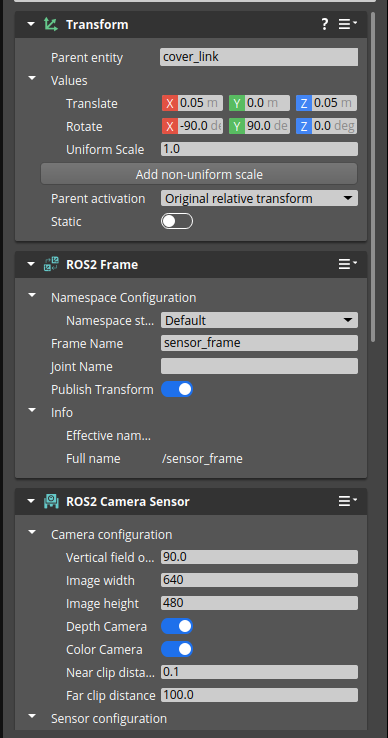
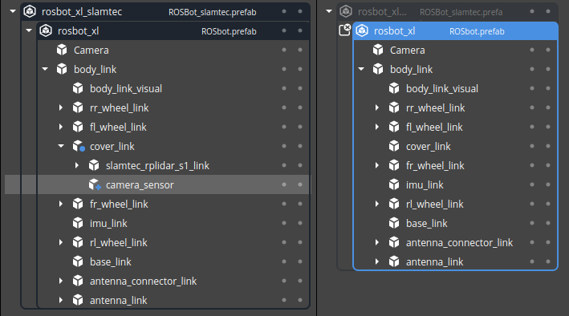
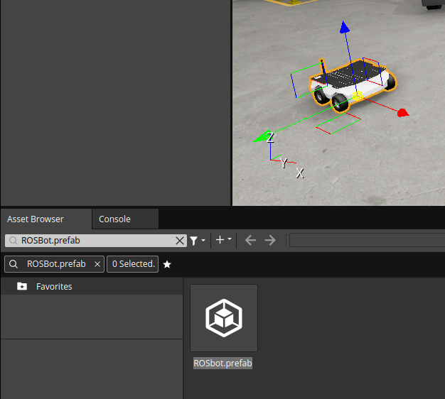

.. redirect-from::

    Tutorials/Simulators/O3DE/Setting-up-a-Robot-Simulation-O3DE
    Tutorials/Advanced/Simulators/O3DE

Setting up a robot simulation (Basic)
=====================================

**Goal:** Modify a simulation scene and display data transmitted over ROS 2 framework.

**Tutorial level:** Basic

**Time:** 20 minutes

.. contents:: Contents
   :depth: 2
   :local:

Background
----------

In this tutorial you will extend the project created in the first tutorial: :doc:`./Installation-Ubuntu`.
The aim is to learn how O3DE Editor works and how it can be used to modify the simulation scene, existing robots, and ROS 2 interfaces.

Prerequisites
-------------

This is a continuation of the first part of the tutorial: :doc:`./Installation-Ubuntu`.
It is mandatory to start with the first part to ensure the project based on the correct template is build successfully.

Sample simulation modifications using O3DE Editor
-------------------------------------------------

1. Quick tour over O3DE Editor and ``rosbot_xl`` prefab
^^^^^^^^^^^^^^^^^^^^^^^^^^^^^^^^^^^^^^^^^^^^^^^^^^^^^^^

The basic interface of the O3DE Editor consists of the *Entity Outliner* panel on the left side of the window and the *Inspector* panel on the right side. Note, that the default layout can be modified: the tools can be moved freely. The first tool, *Entity Outliner*, lists all entities in the scene. Each entity is built up from the number of optional components, such as mesh, ROS 2 sensors, colliders, joints, etc. Components can be added and removed using the *Inspector*. Each entity can have some child entities to build a tree structure. E.g. a robot body entity can be linked with four entities representing wheels. 

An entity or a structure of entities, can be stored as a *prefab*. This way, the same part of the simulation (e.g. a robot) can be reused in different projects or easily duplicated in the scene. Each prefab can be additionally modified with some *overrides*, which change one or multiple parts of the *prefab*, to handle the variations of the repeatable objects. Such modifications are stored within a game level or another *prefab*. The Husarion ROSBot XL robot in ``Levels/DemoLevel`` level is an example of such *prefab*.  The ``rosbot_xl`` entity tree, with some basic components such as colliders, robot control and sensors, is stored as a *prefab*, which is encapsulated in ``rosbot_xl_slamtec`` *prefab*. The outer layer adds a Slamtec RPLiDAR S1 sensor to the robot (other variations are available in the Gem), while the ``rosbot_xl`` *prefab* has no lidar sensor.

2. Updating ``rosbot_xl`` prefab: add the camera sensor
^^^^^^^^^^^^^^^^^^^^^^^^^^^^^^^^^^^^^^^^^^^^^^^^^^^^^^^

Click on the *rosbot_xl_slamtec prefab* in the *Entity Outliner* panel on the left and drill down to *rosbot_xl→body_link→cover_link* entity. Right click on *cover_link* and select *Create Entity*. A new entity named *Entity1* will be created. Select it in the *Entity Outliner*. You might want to change the name (use the right click or press *F2* key). Navigate to the *Inspector* panel on the right. First, modify the *Transform Component* with the following translation values: ``{0.05, 0.0, 0.05}``. This way your newly created entity will be located 5 cm to the front of the robot and 5 cm above the *cover_link* origin. Additionally, add *-90* degrees and *90* degrees rotations around the *X* and *Y* axes respectively. The rotation cancels out the difference in the coordinate systems between O3DE and ROS 2 definition. Finally, add *ROS2 Frame* and *ROS2 Camera Sensor* components using *Add Component* button in the *Inspector* panel. Adjust the namespace of the sensor (within *ROS2 Frame* component) and the parameters of the camera if necessary. By default, RGBD data is streamed over ROS 2 topics ``/camera_image_color`` and ``/camera_image_depth``. Part of the *Inspector* panel with the camera sensor configuration is presented below.

This tutorial assumes the ``rosbot_xl`` robot is modified using *overrides*, but you might want to add the camera sensor to the *prefab*, which would add it to any instance in any project (it is a part of the Gem that is stored within O3DE codebase). Double-click on the *prefab* name iin the *Entity Outliner* panel to open the edit mode for the selected *prefab* and press escape key to switch back to *override* mode. An comparison of the two modes is presented below, with the *override* mode on the left (the *camera_sensor* entity is added to the *cover_link* as an *override*) and *prefab* modification on the right (lidar and camera sensor entities are missing).

To see the effect of adding a camera sensor to the robot, start the game mode in O3DE Editor and open RViz2 application in a new terminal. Navigate to *Add* button at the bottom of the left panel to add a viewport with an image stream. The fastest configuration is done by selecting a stream using the ROS 2 topic. Select *Image* under the ``/camera_image_color`` topic (or any other you set in the O3DE Editor) and confirm to create the display. Keep in mind, the image might not be visible due to some misconfiguration. By default, O3DE uses *Best effort* reliability policy, while RViz2 sets *Reliable* initially. Change either of the two to match the other to secure data transmission.

The ROS 2 launcher described in the previous tutorial can be used to move the robot around the scene. Similarly, it can be navigated using cursor keys on the keyboard or by sending a velocity message to its ``/cmd_vel`` control topic.

Quit the game mode by pressing *ESC* on the keyboard to finish. Close all RViz2 windows.

3. Add ``rosbot_xl`` prefab to the scene
^^^^^^^^^^^^^^^^^^^^^^^^^^^^^^^^^^^^^^^^

*Asset Browser* panel in the bottom of the default O3DE Editor layout is used to add more objects to the scene. Those can be either *prefabs* or visual assets (meshes). Use a search window in the top-left corner to find ``ROSBot.prefab``. Next, drag and drop it to the scene to get a second robot in the simulation. It is illustrated in the image below. Note, that the new robot has no lidar attached to the *cover_link* entity, which is a part of the ``rosbot_xl_slamtec`` *prefab*.

Both robots have the same configuration, which would result in a collision of messages transmitted using ROS 2. This problem can be solved by the namespace modification in any of the two. Head to the ``body_link`` of the previously added robot in the *Entity Outliner* panel. Next, find the *ROS 2 Frame Component* in the *Inspector* panel and modify the namespace configuration as presented below. In this example, the *Namespace Setting* is *Custom* and the name itself is *second*. The change is made as an *override*, which is marked with a blue dot in the O3DE Editor. The local modification ensures the correct communication within this simulation without changing any other uses of Husarion ROSbot XL robot.

Start the simulation and open a terminal to see the available ROS 2 topics. Besides standard topics available in any O3DE simulation using ROS 2, such as ``/clock``, ``/rosout`` and ``/tf``, you will also see the topics published by your robots. In particular, the first robot publishes the lidar data (topic ``/scan``), allows for the control using the ``/cmd_vel`` topic, and publish the camera sensor's data over multiple topics, as configured earlier. The second robot, which is not equipped with neither a lidar nor a camera sensor, creates only the robot control topic, which is additionally namespaced: ``/second/cmd_vel``. 

Publish a message to start the movement of the second robot. Next, publish a message to rotate the first one.

 .. tabs::

    .. group-tab:: Linux

       .. code-block:: console

        ros2 topic pub /second/cmd_vel geometry_msgs/Twist "linear: { x: 0.1 }"
        ros2 topic pub /cmd_vel geometry_msgs/Twist "angular: { z: 0.5 }"
